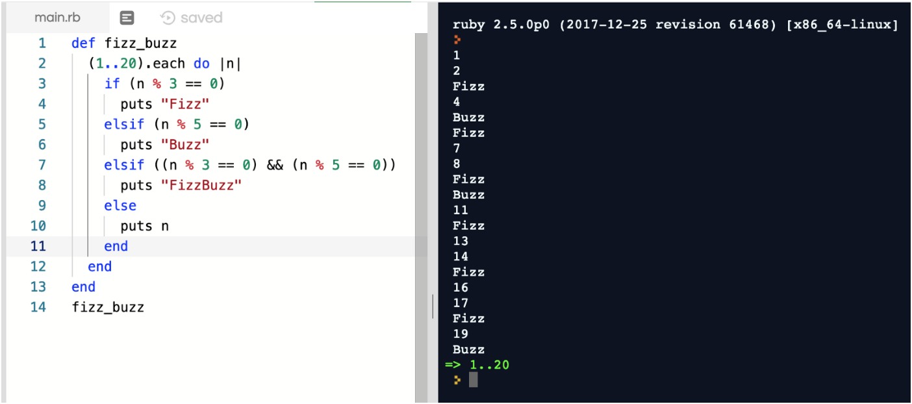
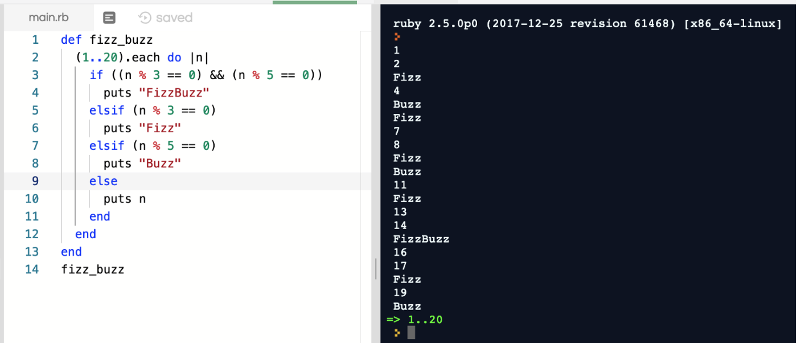
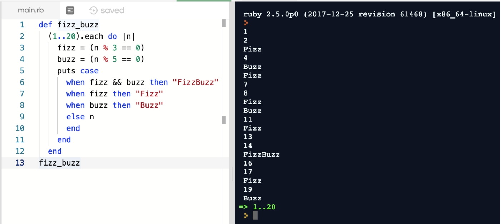

Weeks 2 and 3 of the Makers pre-course material delve deeper into the fundamentals of object [orientated languages](https://en.wikipedia.org/wiki/Object-oriented_programming) (Makers starts with Ruby for its easy syntax). Over the two week period, students follow a curriculum covering topics such as arrays, hashes and methods, with challenges set to test one’s understanding of each new topic as they are introduced.

As well as encouraging the mastery of Ruby’s syntax, the challenges help build confidence in writing real-world, procedural programmes.

### FizzBuzz
FizzBuzz is simple programming challenge used in software development interviews to determine whether a candidate can actually write code. Here is a description of the task:

*Write a program that prints the numbers from 1 to 20. But for multiples of three print “Fizz” instead of the number and for the multiples of five print “Buzz”. For numbers which are multiples of both three and five print “FizzBuzz”.*

**First attempt at solving the above challenge**

In the above fizz_buzz method, we are instructing that for each of the numbers 1 to 20 to replace multiples of 3 with Fizz, multiples of 5 with Buzz and that if the number is divisible by both 3 and 5 to print Fizzbuzz. Else, print number.

Seems like an obvious solution. However, you will notice that our output (right-hand window) isn’t quite what the challenge asked for. Notice that each of the numbers divisible by 3 is printed as Fizz and that each of the numbers divisible by 5 is printed as Buzz. So what’s going on with 15 and why is it printing as Fizz instead of FizzBuzz?

The method defined above is interpreted as follows:

* if number is divisible by 3, print Fizz
* else, if number is divisible by 5, print Buzz
* else, if number is divisible by 3 and 5, print FizzBuzz
* else, print number.

So, when the programme is running the number 15, it never gets to the FizzBuzz if-statement. Instead, the first line in our method for Fizz is satisfied and so the programme stops there and moves onto the number 16.

In order to address this error, we need to change the order in which the if-conditions are checked, ensuring that none of the conditions are already satisfied by a previous condition.

**Implementing above understanding**

Now that we have a working programme, let’s see if it can be tidied up a bit.

The method defined above is interpreted as follows:

* if number is divisible by 3 and 5, print FizzBuzz
* else, if number is divisible by 3, print Fizz
* else, if number is divisible by 5, print Buzz
* else, print number.

### DRY

Using the Don’t Repeat Yourself (DRY) principle, we can refactor the above code by removing redundancy and repeated code.

Applying the DRY principle to the above implementation, the most obvious sources of duplication are:

* `i % 3 == 0` and `i % 5 == 0` : both appear twice
* `puts` : appears four times

The refactored implementation has a few advantages over the previous ‘corrected’ one. If the challenge were to change and asked for Fizz to be printed for multiples of 7, we could easily modify our programme by altering a single line. On the ‘corrected’ solution, we would have had to modify two lines. And if we decided that we wanted to do something other than `puts` , we now only have to modify a single line instead of four.

To summarise, the DRY principle reduces the likelihood of bugs being introduced when updating the code.

