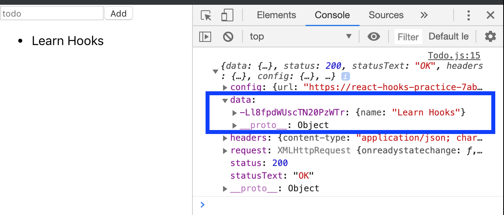

Having built a [side project](https://www.youtube.com/watch?v=paqPJm1JUO0&feature=youtu.be) using the containers / presentational components structure, I was curious about whether it might be easier to follow the flow of data (and whether the components managing state might be easier to test) using hooks instead of class-based components. 

So, I set out to completely re-structure my project by replacing the class based components with hooks. To approach this task with a bit more confidence, I built a mini [Todo List project](https://github.com/MaxRobertsDear/React-Hooks) to practice using hooks and understand the context in which they may be helpful. 

Below are my notes on each of the hook methods:

### useState()

* takes an initial state
* useState() returns an array containing two elements
* the first element is the current state
* the second element is a function that can be used to manipulate the state

Using array destructuring, an example may look like this:
``` bash
const [todoName, setTodoName] = useState('')
const [todoList, setTodoList] = useState([])
```

In the first instance, todoName is the current state of a list item and setTodoName is a function that can manipulate that state. 

The todoList is an array (which can be used to store a list of todoNames with `setTodoList(todoList.concat(todoName))` which can be manipulated with the setTodoList function.

### useEffect()

* is executed when the component is loaded for the first time and each time after the component renders
* can be used callback functions to which side effects are passed (e.g. making HTTP requests, sending analytics data to a server, etc.) - these should not be called during the render method, because state changes may not be picked up and it may impact the performance of the program due to the way that react works under the hood
* encapsulating callback functions that handle side effects with useEffect() ensures that they are executed at the right time - after the render cycle, thereby ensuring high performance and avoiding unexpted state changes
* takes an array of values as a second argument that are observed. Only if the values of the second argument change, will useEffect run the nested arrow function again (remember, that useEffect() runs after every render cycle).
* componentDidMount() - to replicate componentDidMount(), just pass an empty [] as the second argument. This will ensure that the nested arrow function is only run once
* componentDidMount() + componentDidUpdate() with an if check included in it - pass a second argument (e.g. [todoName] in below example)

``` bash
useEffect(() => {
    axios.get('https://react-hooks-practice-7ab69.firebaseio.com/.json').then(result => {
      console.log(result)
      const todoData = result.data
      const todos = []
      for (const key in todoData) {
        todos.push({id: key, name: todoData[key].name})
      }
      setTodoList(todos)
    })
  }, [todoName])
  ```

Data is retrieved from firebase, where result.data will return a list of objects that are stored under cryptographic keys:
. 

To map these objects into an array, I'm iterating across each key in todoData and pushing the key and associated name (which contains the text of the todo item) to the todos array. Using the setTodoList(), I am then updating state. 

The second argument passed, todoName, means that useEffect() will re-render everytime todoName changes.

### useContext() 

### useReducer()

