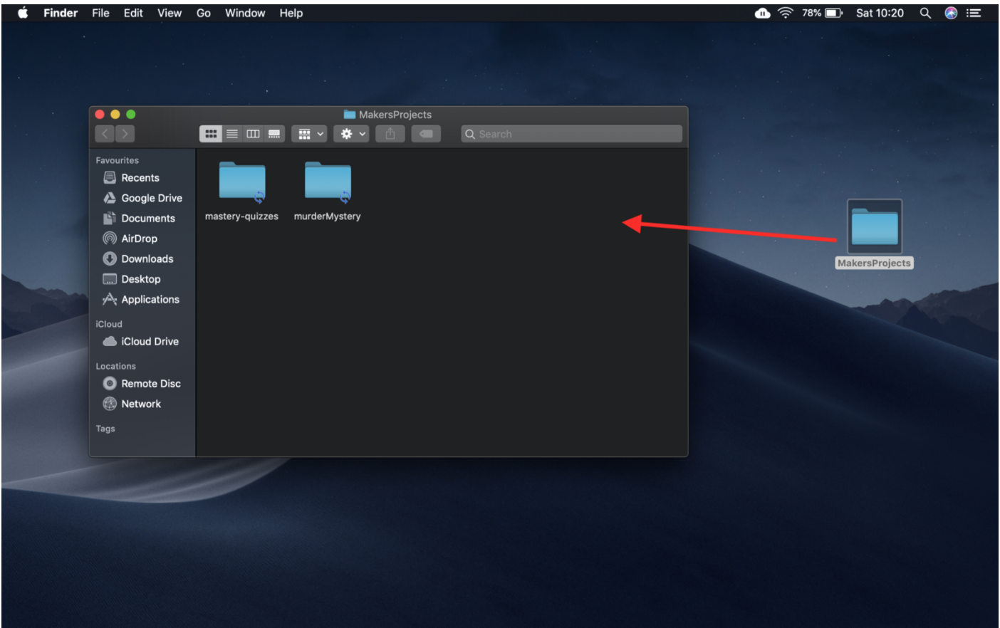
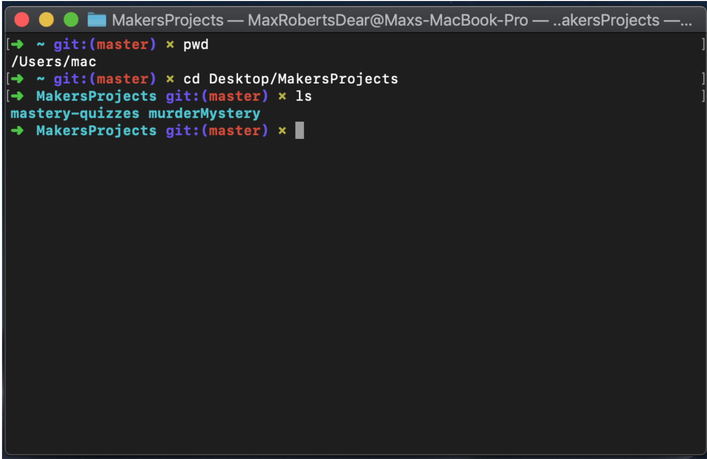
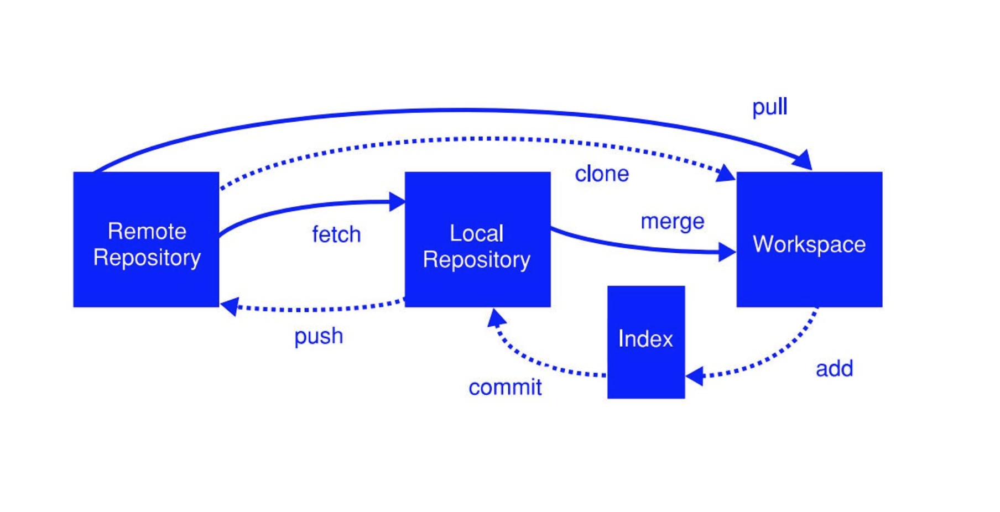

The Makers Academy course comprises 16 weeks: 4 weeks of preparation work, which is done remotely in your own time, followed by a full-time 12 week course onsite.

Week 1 of the pre-course introduces students to the core tools that are used every day in the life of a developer: the command line and version control.

Our challenge at the end of week 1 was to solve a murder mystery using only the command line to navigate a large number of files and search for clues, committing all checkpoints to git, our version control system. The murder mystery was a fun way to learn the basic command line prompts and Makers went easy on us novices by providing a thorough step-by-step guide.

Though the challenge was easy to complete (and therefore a nice confidence booster), I didn’t feel that I grasped what the command line actually is or how version control works. Below, I draw parallels between the command line and a more familiar user interface to make it less alien, and explain the git commands via an illustration to make them less abstract.

### Command Line
The command line interface (CLI) is a way for users to interact with software by means of text-based prompts. It is quite different to the more familiar way to interact with a computer, via the graphical user interface (GUI), where users navigate the computer with a mouse.

The GUI is what most people use to navigate their computer. Below is an example of me opening the MakersProjects folder on my Desktop to view its contents:

Looks familiar, right?

Below is a screenshot of what the same action would look like on the CLI. By printing the current working directory, using pwd , I can see that I am in the home directory ( `=>/Users/mac` ). I can change directories into the MakersProjects folder using the cd command and list its contents with ls .

Both the CLI and GUI are ways of interacting with your computer. Once the CLI has been mastered, it is a faster and more powerful means of navigating your computer and is therefore preferred by developers.

### Version Control
*I didn’t get git.*

No matter how well worded an explanation, I didn’t feel that I truly understood the difference between `fetch`, `merge`, `clone`, `pull`, `push`, `add`, `remote`, and `commit` . I find it much more helpful to visualise the git data transport commands:

* `git init` initialises the local git repository in the current directory.
* `git add` adds a change in the working directory to the staging area, so that you can start versioning your files locally.
* `git commit` adds all the changes of the files in the staging area to your local git repository
* `git push` publishes your local changes to the remote repository so that everyone can have access to your changes. You are literally “pushing” your changes onto the remote.
* `git fetch` downloads commits from the remote repository into your local repo.
* `git merge` taking the changes from one branch and adding them to another (usually the master branch). A common way to do this is via a “pull request” — you are proposing changes to a repository, which are accepted or rejected by the repository’s collaborators. Other common ways to do this are via push request, merge requests or manual merges. There is a good explanation on the differences in Stackoverflow.
* `git pull` (in simple terms) does a git fetch followed by a git merge
* `git checkout` is used to switch between different ‘branches’ (E.g. you are currently on master branch and you want to switch into develop branch. git checkout develop_branch )
* `git clone` copies an existing repo into a new directory on your computer. This allows you to contribute to the repository and use git to track your changes, without the need to be online. A branch can track another branch on a remote repository, thereby becoming a tracking branch that can be kept in sync with its origin branch (via pushes, pulls, and fetches)
* `git remote` can be used to add, remove, or change the remote repository to which your local repository is connected, giving you control over which repositories you want to synchronise your changes with.

